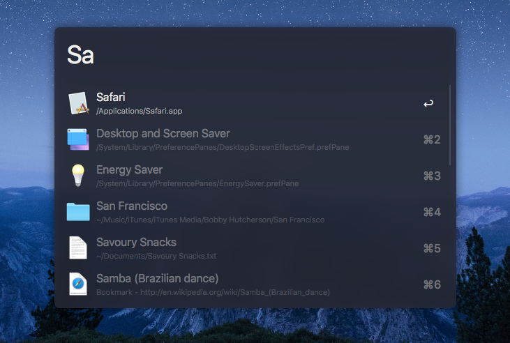
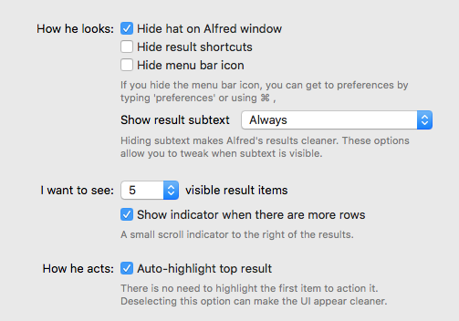

# alfred-wildflame-dark

> A nice dark theme for [Alfred](https://www.alfredapp.com)

## Install

[Install the theme.](https://www.alfredapp.com/extras/theme/m1IO3HghPw/)

*You need the [Powerpack](https://www.alfredapp.com/powerpack/) for custom themes.*

## Options

Use the following options to have it look exactly like in the screenshot above.

## License

MIT © [KingScooty](http://wildflame.co.uk)
